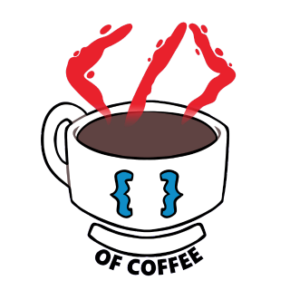

# Coffee Files Client

<div align="center" width="320px">



</div>

This is the client for
[coffee-files-backend](https://github.com/martindotpy/coffee-files-backend).

## Technologies

We are using Typescript with React to create the client for this project. In this case it's composed of the following technologies:

- React
- Vite
- tailwindcss
- [Coffee Files API](https://github.com/luisBazanDev/coffee-files)

## How to run

To run this project you need to have [yarn](https://classic.yarnpkg.com/lang/en/docs/install) installed on your machine.

1. Install dependencies

```bash
yarn install
```

2. Run development environment

```bash
yarn dev
```

2. Build Aplication

```bash
yarn build
```
